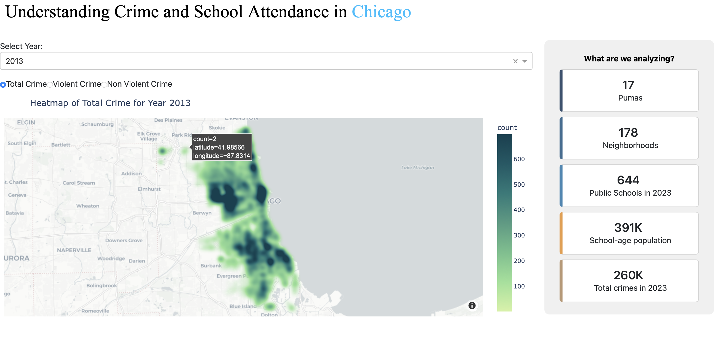
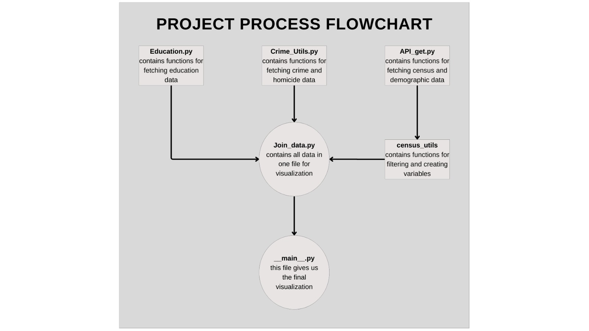

# Understanding School Dropouts in Chicago: The Role of Crime and Socioeconomic Factors

## Abstract
Early school dropout is a multifaceted challenge that impacts education systems and societal outcomes in both developed and developing countries. In the United States, this phenomenon varies notably across and within regions. For instance, Chicago public schools display a wide range of 9th-grade dropout rates, ranging from 0% to 56.6% (CDPS, 2024). While the influence of individual, family, and school characteristics is well documented, a growing body of studies has begun to explore the effects of broader social contexts on adolescent educational outcomes such as neighborhood crime or violence. 

This project aims to integrate, analyze, and visualize spatial, administrative, and demographic data to characterize school dropouts across Chicago schools, with a particular focus on the role of crime in shaping these educational outcomes.



## Authors
- *Angela López Sanchez*
- *Cesar Núñez*
- *Shahzaib Jamali*


## Project Video:
[Project Video](linktovideo)
***

### Data pipeline
This project is structured to collect, process, and visualize data from multiple sources, focusing on education, crime, census, and demographic data. The pipeline follows a structured approach to integrate and process these datasets efficiently. Below is an overview of the data flow:



- education.py: Contains functions to fetch education-related data.
- crime_utils.py: Includes functions for retrieving crime and homicide data.
- api_get.py: Fetches census and demographic data through API requests.
- census_utils: processes census data by filtering and creating relevant variables.
- join_data.py: Combines data from all the sources into a single dataset for visualization.
- quadtree.py: 
- merge_shp:
- __main__.py: Generates the final visualization using the processed data.

***
### How to run the project

As this module brings together information from different data sources. To run this program it is necessary to provide an APP key for the City of Chicago Data.
The steps to create an APP KEY are:

1. Enter https://data.cityofchicago.org/ to create an account
2. Enter https://data.cityofchicago.org/profile/edit/developer_settings and hit "Create a new App Token"
4. Safe your APP TOKEN in a safe place 

For the simplicity of this milestone you can work with the key: `Eqk9pQsM8RsYYawwjwyFUTlYj`
you can define a constant in the terminal:

On Windows: 
```
$env:CHICAGO_APP_TOKEN = "Eqk9pQsM8RsYYawwjwyFUTlYj"
```
On Linux/MacOS:
```
export CHICAGO_APP_TOKEN="Eqk9pQsM8RsYYawwjwyFUTlYj"
```

After sort out the API Key step, by running the following commands, an html file will prompt with a draft visualization of our project. 

1. Run `uv sync`
2. Run `uv run andes_indus -m`

### This command may take a minute to load the project to the terminal.
```
You are then given an HTTP link, as seen below. Copy the link into your preferred browser to interact with the webpage locally.

Dash is running on http://127.0.0.1:8050/

 * Serving Flask app 'app'
 * Debug mode: off
 * Running on http://127.0.0.1:8050
Press CTRL+C to quit
```

### Running Tests

To run the tests, please use the following command:

```bash
1. 'uv run pytest tests'
```
***
## Data Sources

### 1. U.S. Census Data - American Community Survey
- *Source:* [U.S. Census Bureau](https://www.census.gov/programs-surveys/acs)
- *Description:* This dataset provides demographic data extracted from the U.S. Census Bureau’s American Community Survey. No API key is required for access.

### 2. Chicago Crime Data - City of Chicago
- *Crime Data:* [City of Chicago Crime Data](https://data.cityofchicago.org/Public-Safety/Crimes-Map/mw69-m6xi)
- *Homicide Data:* [City of Chicago Homicide Data](https://data.cityofchicago.org/Public-Safety/Homicides/ijzp-q8t2)
- *Description:* This dataset includes crime and homicide statistics for the City of Chicago. No API key is required for access.

### 3. Education Data - Chicago Public Schools
- *School Search:* [CPS Typeahead School Search](https://api.cps.edu/schoolprofile/Help/Api/GET-CPS-TypeaheadSchoolSearch_SearchValue)
- *School Profile:* [CPS Single School Profile](https://api.cps.edu/schoolprofile/Help/Api/GET-CPS-SingleSchoolProfile_SchoolID)
- *Description:* This dataset contains school-related information such as attendance rate, graduation rate, school address, and geographical coordinates (longitude and latitude). No API key is required for access.
- *School Metrics:* [CPS Dropout Data](https://www.cps.edu/about/district-data/metrics/)
- *Description:* This excel data set contains information pertaining to the dropout rate of schools for multiple years.
