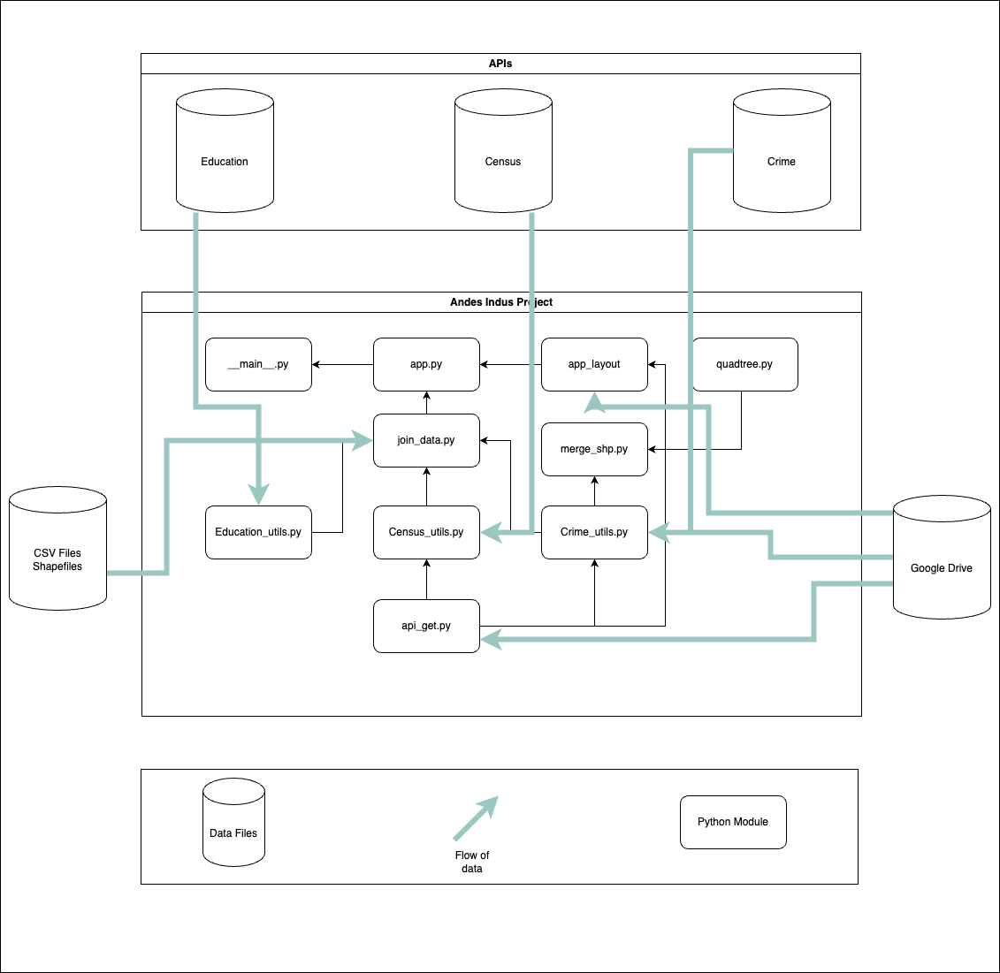

# Understanding School Dropouts in Chicago: The Role of Crime and Socioeconomic Factors

This project aims to integrate, analyze, and visualize spatial, administrative, and demographic data to characterize school dropouts across Chicago schools, with a particular focus on the role of crime in shaping these educational outcomes.By running the application, you will be able to explore these factors and their relationships on an interactive dashboard.

---

## Table of Contents
- [Introduction](#introduction)
- [Data Documentation](#data-documentation)
- [Project Structure](#project-structure)
- [Team Responsibilities](#team-responsibilities)
- [Final Thoughts](#final-thoughts)
- [Contact Information](#additional-resources)

---

## Data Documentation

### 1. U.S. Census Data - American Community Survey
- *Source:* [U.S. Census Bureau](https://www.census.gov/programs-surveys/acs)
- *Description:* This dataset provides demographic data extracted from the U.S. Census Bureau’s American Community Survey. No API key is required for access.

### 2. Chicago Crime Data - City of Chicago
- *Crime Data:* [City of Chicago Crime Data](https://data.cityofchicago.org/Public-Safety/Crimes-Map/mw69-m6xi)
- *Homicide Data:* [City of Chicago Homicide Data](https://data.cityofchicago.org/Public-Safety/Homicides/ijzp-q8t2)
- *Description:* This dataset includes crime and homicide statistics for the City of Chicago. No API key is required for access.

### 3. Education Data - Chicago Public Schools
- *School Search:* [CPS Typeahead School Search](https://api.cps.edu/schoolprofile/Help/Api/GET-CPS-TypeaheadSchoolSearch_SearchValue)
- *School Profile:* [CPS Single School Profile](https://api.cps.edu/schoolprofile/Help/Api/GET-CPS-SingleSchoolProfile_SchoolID)
- *Description:* This dataset contains school-related information such as attendance rate, graduation rate, school address, and geographical coordinates (longitude and latitude). No API key is required for access.
- *School Metrics:* [CPS Dropout Data](https://www.cps.edu/about/district-data/metrics/)
- *Description:* This excel data set contains information pertaining to the dropout rate of schools for multiple years.

### Data Gaps & Challenges
- **Gaps:** 
    - Crime: 
    - Education : The data for school location and profile was only available for current year. Secondly, data for dropout
    and attendace were available from two different source types, excel and APIs.
    - Census
- **Quality Issues:** Describe inconsistencies, outliers, or other data quality challenges.

- **Mitigation Strategies:** Explain how these issues were addressed.
    - Crime : 
    - Education : We created two seperate csv files from the two sources and merged the data to make it comparable and accessible.
    - Census :

### Data Flow and Project Structure

- **Overview:** Explain how data is ingested, processed, and output.
- **Diagram:**  

- **Additional Considerations:** Highlight any key points a newcomer should know about data handling, security, or compliance.

---

## Project Structure

### Overview
- Provide a brief description of the project layout and its modular design.

### Modules and Their Functions
- **Module A:**  
- *Purpose:* Explain what this module does.  
- *Key Components:* List functions or classes.
- **Module B:**  
- *Purpose:* Describe its functionality.  
- *Key Components:* List major elements.
- *(Add more modules as applicable.)*

## Team Responsibilities

### Team Member Contributions
- **Team Member 1 (Angela Lopez):**   
  - *Responsibilities:* 

    - Data Collection: Pulled data from the census API. API-Get.py
    - Data Cleaning: Created functions for cleaning census data. census_utils.py
    - Data Engineering/Database: 
    - Data Visualization: Creating graphs for demoraphic and attendace rate. figures.py

- **Team Member 2 (César Núñez):**  
  - *Responsibilities:* 

    - Data Collection:
    - Data Cleaning:
    - Data Engineering/Database
    - Data Visualization: 

- **Team Member 3 (Shahzaib Jamali):**  
  - *Responsibilities:* 

    - Data Collection: Pulled data from CPS APIs and accessed Dropout data from excel file 
    - Data Cleaning: Cleaned the data for education and merging API data and excel data. Education.py
    - Data Engineering/Database: 
    - Data Visualization:

### Collaboration Notes

The team coordinated its efforts by establishing a clear version control strategy. Each member worked on an individual branch within the repository, allowing for independent development of features and updates. All changes were communicated through commits from these branches into a centralized main branch, ensuring that updates were systematically integrated and the project's progress remained transparent..

---

## Final Thoughts

### Project Goals vs. Outcomes
- **Intended Goals:** Summarize what the project set out to achieve.
- **Outcomes:** Reflect on what was actually accomplished.
- **Lessons Learned:** Note key takeaways and areas for future improvement.

---

- **Contact Information:** Provide details on how to reach the team for support or contributions.
- Angela : [Github](https://github.com/AngelaLop) [Email](alopezsanchez@uchicago.edu)
- César  : [Github](https://github.com/cesarnunezh) [Email](cnunezh@uchicago.edu)
- Shahzaib : [Github](https://github.com/Shahzaib-Jamali) [Email](shahzaibjamali@uchicago.edu)
